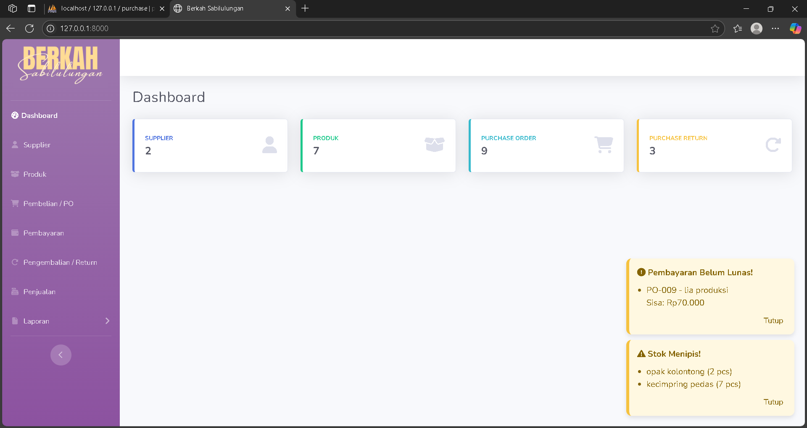

# 🛒 Toko Berkah Sabilulungan – Purchasing Management System

Aplikasi web berbasis **Laravel** dan database menggunakan **MySQL** untuk mengelola proses pembelian dan penjualan pada **Toko Berkah Sabilulungan**, usaha oleh-oleh khas Cililin.  
Proyek ini dibuat untuk membantu toko dalam **mencatat transaksi secara digital**, sehingga lebih **efisien, akurat, dan terorganisir**.

---

## ✨ Fitur Utama
- 📦 **Manajemen Supplier** – tambah, edit, hapus, dan kelola data pemasok.
- 📝 **Purchase Order** – membuat, mengedit, dan memantau pembelian produk.
- 🔄 **Return Order** – pencatatan retur barang ke supplier.
- 💰 **Pembayaran PO** – pencatatan pembayaran, pelunasan, serta laporan pengeluaran.
- 🛍️ **Penjualan** – pencatatan transaksi penjualan dengan detail produk, diskon, dan metode pembayaran.

---

## 🛠️ Teknologi
- [Laravel 10](https://laravel.com/) – Framework utama
- [MySQL](https://www.mysql.com/) – Database
- [Bootstrap 5](https://getbootstrap.com/) – Frontend UI
- [Font Awesome](https://fontawesome.com/) – Icon library

---

## 🚀 Instalasi
Ikuti langkah berikut untuk menjalankan proyek secara lokal:

```bash
# Clone repository
git clone https://github.com/username/nama-repo.git
cd nama-repo

# Install dependencies
composer install

# Copy environment file
cp .env.example .env

# Generate key aplikasi
php artisan key:generate

# Migrasi dan seed database
php artisan migrate --seed

# Jalankan server
php artisan serve

---

## 📸 Screenshots

### Dashboard


### Form Supplier

